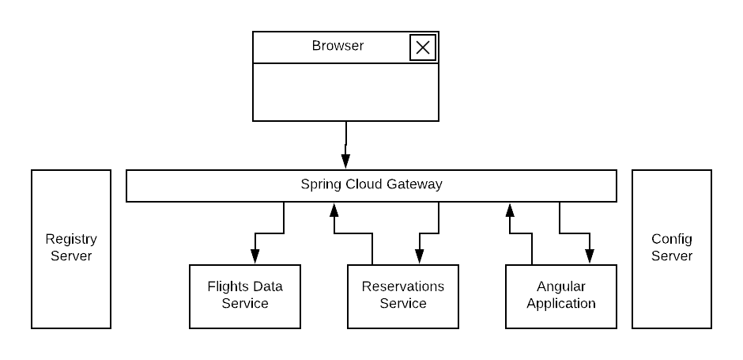

= Second Generation Spring Security OAuth2

== RA - Spring Boot 2 Sample Application

:y: &#10003;
:tip-caption:

This application - serves an online booking system - is created as a reference architecture to illustrate how to
secure a microservice-based application with the next generation of OAuth2 supported in Spring 5.x.

== Run the application

Run all services and access the application at http://localhost:8080.

A user can fetch flights (use origin airport as AUS, distintation airport IAH, depart 2018/5/5 and return 2018/5/22).

The application searches and displays outbound flights, inbound flights, requests
a passenger's basic information and address, books the itinerary and
displays booking confirmation numbers.

image:./images/home-page.jpg[front-end]

== Architecture

The application consists of a couple of backend services, an Angular front-end application
and Spring Cloud common services as a registry and a configuration servers. The backend services are
implemented with the Spring boot reactive support (Spring WebFlux). The application is fronted by an
edge service implemented using a Spring Cloud Gateway.

Services included in the application are:

* Flight search service, purposed as a data-as-a-service that exposes available flights per a search criteria
* Reservation service, to book flights
* Edge proxy service implemented using Spring Cloud Gateway
* Front-end application written in Angular 6
* Spring Cloud Configuration Server
* Eureka registration Server

== Security

[TIP]
 Security is yet to be implemented to use "Spring Cloud Security". Spring team has an opened feature to provide
 Spring Cloud Gateway with features for parity with Zuul. This helps with ability to integrate Spring Cloud Gateway
 with OAuth2 and to have features such as Single Sign-On and tokens relay. To keep on updating this RA repo, the below
 feature matrix is provided to be aware of what is implemented so far.

[%header,format=csv]
|===
Feature,Implementation
Reactive backend services, {y}
Angular Front-end application, {y}
Spring Cloud Gateway,{y}
Testing,{y}
SSO, IP
|===